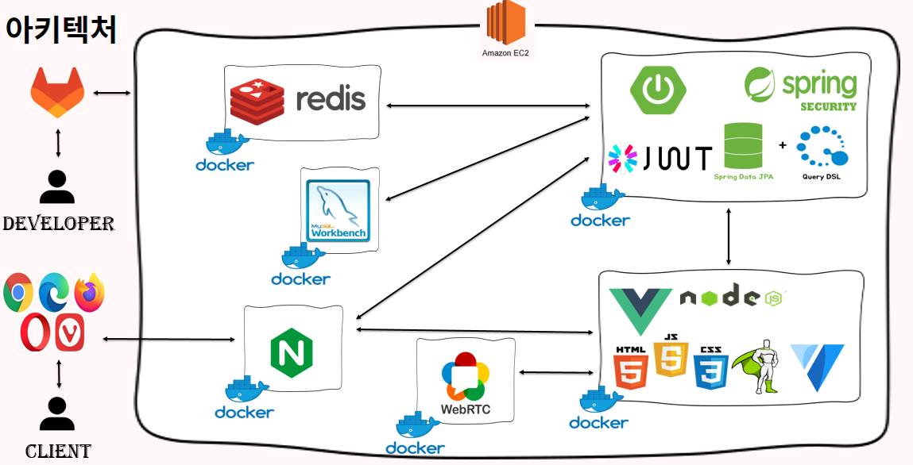
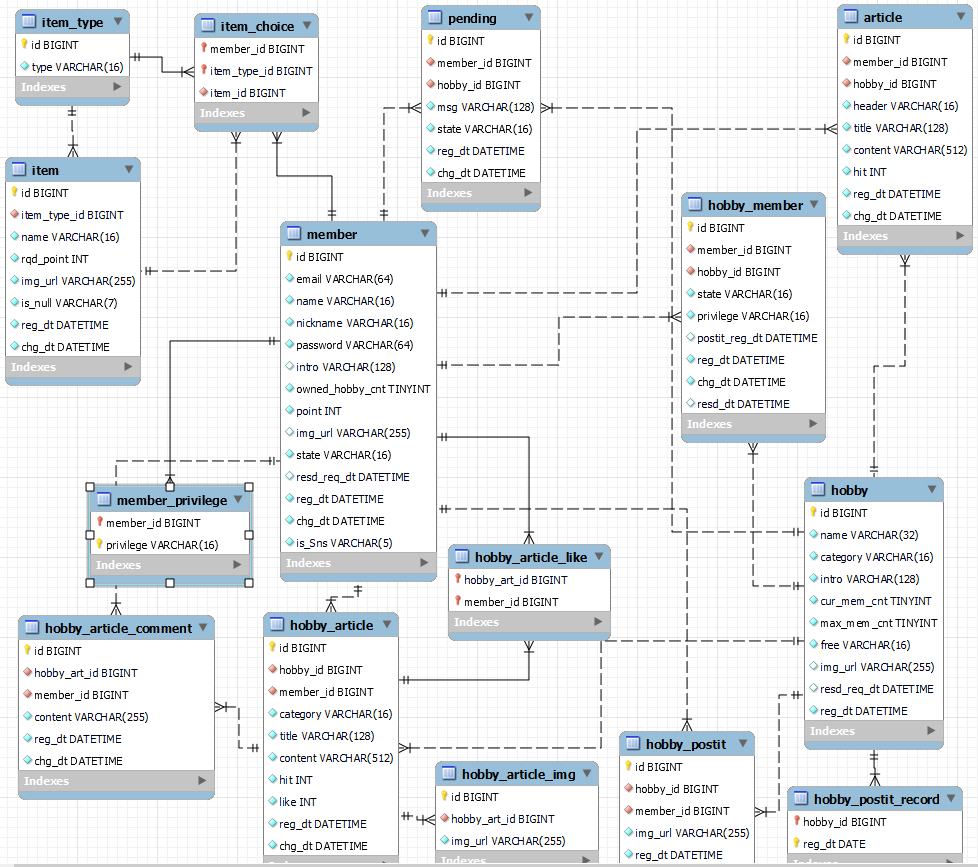

# 👪 HOBBY'IT - 온라인 취미 공유 플랫폼


## 🎥 소개 영상 보기 : [UCC 링크](https://www.naver.com/)

## ⌛️ 프로젝트 진행 기간
2023.01.09(월) ~ 2023.02.17(금) (40일간 진행)<br>
SSAFY 8기 2학기 공통 프로젝트

## ✨ HOBBY'IT 서비스 개요
### 기획 배경
- 온라인 소모임, 취미 활동에 대한 수요 증가
- 비대면 문화와 시장 확대
- 비용과 사용자 경험을 동시에 만족시킬 수 있는 서비스 필요

### 기존 서비스 분석
1) Naver BAND
   - 중장년층에 인기
   - 커뮤니티 기능이 있음
   - **오프라인 모임 위주의 성향**
   - **화상 회의를 즐길 수 있는 감성과 흥미 컨텐츠가 부족**
2) Discord
   - 비용 발생이 적음
   - **기능이 너무 많고, 버그 발생이 잦음**
   - **소모임 관리의 어려움**
   - **어려운 UI 특징**
3) Webex
   - 안정적인 회의 진행 기능 지원
   - **시간 및 참여 인원에 제한이 있고, 과금이 필요함**
   - **커뮤니티 기능이 없음**
   - **화상 회의 이외의 컨텐츠가 없음**
4) ZOOM
   - **원격 제어와 투표 기능이 지원됨**
   - **시간 및 참여 인원에 제한이 있고, 과금이 필요함**
   - **흥미 요소가 적거나 많은 비용이 발생함**

## 🏃 HOBBY'IT 의 이용 목적
혼자보단 둘,
둘보단 다 같이! 👪

관심 있는 모임에 들어가거나,
동료들을 구해보는 건 어떨까요?<br>
다함께 취미생활을 기록하고 공유하세요.
혼자보단 분명 더욱 즐거울 겁니다!

24/7 즐기는 취미생활
사진 공유, 방명록, 화상채팅까지!
언제 어디서든 추억을 쌓아갈 수 있습니다.

내가 속한 모임별로 특별한 추억들로
채워 가보세요 :)

## 🌞 팀원 소개
### 유쾌한 반란
호방한 사람들이 될 서울 5반 5조

- 박귀렬 - BackEnd, 팀장
- 이인재 - BackEnd
- 강은진 - BackEnd
- 김수빈 - FrontEnd
- 이정범 - FrontEnd
- 서철원 - FrontEnd

## ✔️ 아키텍처 구성도


## ✔️ 주요 기능
### 1) JWT 토큰과 Spring Security 로그인 및 Redis 저장소 활용
- Redis 저장소를 활용해 메모리상에서 빠르게 토큰을 검사하여 회원 정보를 조회

### 2) 모임 구성원 간의 화상 통화와 채팅 기능 - WebRTC
- WebRTC 기술을 사용하여, 웹상에서 빠른 속도로 화상 통화와 채팅이 가능
- 개인 카메라와 오디오 설정
- 화상 통화 도중에도 캔버스 페인팅 가능

### 3) 모임 관리자의 가입 신청 회원 및 모임 활동 관리
- 모임을 처음 생성한 사람은 해당 모임의 소유자가 됨
- 모임 소유자는 새로 가입 신청한 회원들을 관리(관리자 권한 부여 등)

### 4) 모임 게시판을 통한 모임 커뮤니티 활성화
- 최대 10장의 사진과 512글자의 내용을 작성할 수 있는 모임 게시판
- '무한 스크롤'과 '다이나믹 스크롤'을 통한 UX 제공

### 5) 모임 방명록을 통한 캔버스 페인팅
- 하루에 한 번 캔버스 다이어리 작성
- 하루 전 날짜의 작성일을 가진 방명록들만 조회 가능
- 모임 활동에 대한 기대와 관심, 동기 부여를 위해 익일부터 조회할 수 있도록 설정

### 6) MZ스러운 디자인과 친절한 이용 가이드
- GSAP 애니메이션 효과와 다크모드 디자인, 짙은 보랏빛 컬러
- 사용자를 위한 이용가이드 페이지 제공


## ✔️ 주요 기술
### 1) WebRTC
- P2P(Peer-to-Peer Network)로 브라우저나 단말 간에 데이터를 주고받는 기술의 웹 표준
- 웹에서 실시간 미디어 스트림을 송수신할 수 있는 유일한 표준이고 또 유일한 P2P 표준

### 2) JWT 토큰과 Spring Security 로그인 및 Redis 저장소 활용
- JWT 토큰을 통해 사용자 정보를 암호화하여 보안성을 높임
- Spring Security를 통해 로그인한 사용자의 정보를 편하게 인가 받음
- Redis 저장소를 활용해 메모리상에서 빠르게 토큰을 검사하여 회원 정보를 조회
- Redis 저장소에 key-value 형태로 memberId-RefreshToken 정보를 저장함

### 3) '무한 스크롤'과 '다이나믹 스크롤'을 통한 UX

### 4) 캔버스 페인팅

## ✔️ 프로젝트 파일 구조
```
Repository
 ├─ README.md
 │
 ├─ docs
 │     │
 │     ├── DB
 │     │    ├── ...
 │     │
 │     ├── Jira
 │     │    ├── ...
 │     │
 │     ├── img
 │          ├── ...
 │
 │
 ├─ backend
 │     │
 │     ├── gradle
 │     │     ├──wrapper
 │     │     	   ├── gradle-wrapper.jar
 │     │     	   ├── gradle-wrapper.properties
 │     │
 │     ├── src
 │     │     ├── main
 │     │     	    ├── generated
 │     │     	    ├── resources
 │     │     	    │           ├── static
 │     │     	    │                ├── img
 │     │     	    │	                    ├── ...
 │     │     	    ├── java
 │     │                ├── com
 │     │     	               ├── a505
 │     │                           ├── hobby
 │     │                                 ├── article
 │     │     	                           ├── common
 │     │     	                           ├── hobby
 │     │     	                           ├── hobbyarticle
 │     │     	                           ├── hobbyarticlecomment
 │     │     	                           ├── hobbyarticleimg
 │     │     	                           ├── hobbyarticlelike
 │     │     	                           ├── hobbymember
 │     │     	                           ├── hobbypostit
 │     │     	                           ├── hobbypostitrecord
 │     │     	                           ├── item
 │     │     	                           ├── jwt
 │     │     	                           ├── member
 │     │     	                           ├── pending
 │     │     	                           ├── security
 │     │     	                           ├── HobbyitApplication.java
 │     │
 │     ├── .gitignore
 │     ├── build.gradle
 │     ├── gradlew
 │     ├── gradlew.bat
 │     ├── settings.gradle
 │
 │ 
 ├─ HobbyIT(FE)
 │     ├─ README.md
 │     │
 │     ├─ public
 │     │      ├─ assets
 │     │              ├─ fonts
 │     │              │    ├─ ...
 │     │              │
 │     │              ├─ gif
 │     │              │    ├─ ...
 │     │              │
 │     │              ├─ postit
 │     │              │    ├─ ...
 │     │              │
 │     │              ├─ ...
 │     │
 │     ├── src
 │     │       ├── api
 │     │       │       ├── common
 │     │       │       │      ├── ...
 │     │       │       │
 │     │       │       ├── ...
 │     │       │
 │     │       ├── components
 │     │       │       ├── VideoChat
 │     │       │       │      ├── ...
 │     │       │       │
 │     │       │       ├── modals
 │     │       │       │      ├── ...
 │     │       │       │
 │     │       │       ├── no-content
 │     │       │       │      ├── ...
 │     │       │       │
 │     │       │       ├── ...
 │     │       │
 │     │       ├── layouts
 │     │       │       ├── default
 │     │       │              ├── ...
 │     │       │
 │     │       ├── plugins
 │     │       │       ├── index.js
 │     │       │       ├── vuetify.js
 │     │       │       ├── webfontloader.js
 │     │       │
 │     │       ├── router
 │     │       │       ├── index.js
 │     │       │
 │     │       ├── store
 │     │       │       ├── app.js
 │     │       │       ├── index.js
 │     │       │       ├── message.js
 │     │       │       ├── user.js
 │     │       │
 │     │       ├── styles
 │     │       │       ├── settings.scss
 │     │       │
 │     │       ├── views
 │     │       │       ├── ...
 │     │       │
 │     │       ├── App.vue
 │     │       ├── main.js
 │     │
 │     ├── ...
 │     │
``` 


## ✔️ 협업 툴

- GitLab
- Notion
- Figma
- JIRA
- MatterMost
- Webex

## ✔️ 협업 환경
- GitLab
  - 코드의 버전 관리
  - 개발 이슈 관리 및 해결을 위한 회의
  - MR과 팀원의 코드리뷰
- Notion
  - 기획 단계에서 도출된 아이디어 정리
  - 회의록과 팀미팅을 기록하여 의견과 해결사항을 정리
  - 팀 그라운드 룰을 정리
  - Jira 일정 계획 수립
  - Git Commit 컨벤션 정리
  - 참고자료 정리
  - Back-end, Front-end별 개발 이슈 정리
  - API 상태 코드 정리
  - [유쾌한 반란의 NOTION](https://chipped-cart-851.notion.site/f58b19c1a8bc453e945bc57df8147355)
- Figma
  - UI/UX에 초점을 둔 실시간 협업
  - HOBBY'IT 만의 디자인과 메인 컬러 지정
  - 애니메이션, gif 이미지 활용
  - 목업과 와이어프레임 정리
  - [유쾌한 반란의 FIGMA](https://www.figma.com/file/mKMpSGZU6zQK7NP3aRWG8O/%EC%9C%A0%EC%BE%8C%ED%95%9C%EB%B0%98%EB%9E%80-Hobby'It?node-id=0%3A1&t=WKgF5Q8oLOynJk9c-1)
- Jira
  - 일주일 단위로 프로젝트 일정 관리
  - 23.01.10 ~ 23.02.17 기간의 일정 관리
  - 기획, 설계, 개발, 발표, 회의, 내부 행사 등
    <details>
    <summary>번다운 차트</summary>
    <div markdown="1">
  
      - 1주차 (23.01.09 ~ 23.01.13)
    
      - 2주차 (23.01.16 ~ 23.01.20)
    
      - 3주차 (23.01.25 ~ 23.01.27)
    
      - 4주차 (23.01.30 ~ 23.02.03)
    
      - 5주차 (23.02.06 ~ 23.02.10)
    
      - 6주차 (23.02.13 ~ 23.02.17)
  
    </div>
    </details>

## ✔️ 프로젝트 산출물
[유쾌한 반란의 Google Docs - 요구사항 정의서, 기능 정의서, API 명세서](https://docs.google.com/spreadsheets/d/1xG0EUURGoz_C6ZEwFpiaMvZAMSl8EonA/edit?usp=sharing&ouid=102396324034139789583&rtpof=true&sd=true)
- 요구사항 정의서
- 기능 정의서
- API 명세서
- 와이어 프레임(https://www.figma.com/file/mKMpSGZU6zQK7NP3aRWG8O/%EC%9C%A0%EC%BE%8C%ED%95%9C%EB%B0%98%EB%9E%80-Hobby'It?node-id=0%3A1&t=GyGk1I5SxVuR7l80-0)
- 

## ✔️ 프로젝트 결과물
- 포팅메뉴얼
- 중간발표 자료
- 최종 발표 자료

## 👪 HOBBY'IT 서비스 화면
### 1) 회원가입 및 로그인

### 2) 이용가이드 살펴보기

### 3) 모임 살펴보기

### 4) 새로운 모임 생성하기

### 5) 기존 모임에 가입하기

### 6) 모임 내 게시판에 글 등록하기

### 7) 모임 내 방명록에 그림 그리기

### 8) 모임 내 화상 통화 및 채팅 참여하기


<hr>